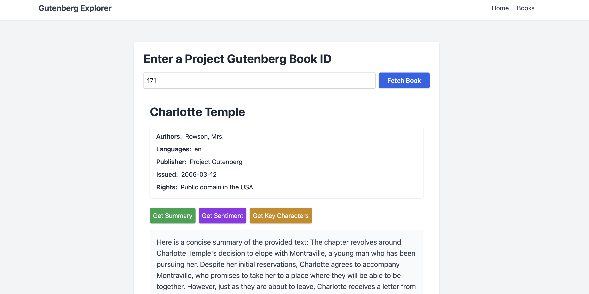

## Project Gutenberg Explorer




### Introduction

This is FastAPI based web application that allows users to search for books from Project Gutenberg. The application uses the Project Gutenberg API to fetch the books and display them to the user.

### Features

- Search for books
- View book details
- Perform Multiple Analysis on the book using LLMs


### Technologies Used
- FastAPI
- HTMX with Tailwind
- Groq LLM


### How to run the application

1. Clone the repository
2. Install the dependencies using `pip install -r requirements.txt`
3. Create a `.env` file in the root directory and add the following variables
    ```
    LLM_TOKEN=your-groq-token
    LLM_TYPE=groq
    REQUEST_PER_MINUTE=60
    ```
    You can get the API key by signing up at [Groq](https://groq.com)
4. Run the application using `uvicorn main:app --reload`
5. Open the browser and navigate to `http://localhost:8000`

